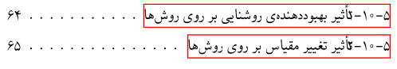
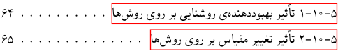

Fix the fixed width for numberline in tocloft
=============================================

Problem definition
------------------
`tocloft` is a package in `latex` that helps users
to design their table of content in the way that they
want to. 

for each `section`, `tocloft` uses an entry like
below to the `title` part of `\addcontentsline`.

.. code-block::

    {\numberline{number} title-text}

Because `\numberline` has a fixed width, sometimes,
especially in right to left languages like `Persian` 
it might cause a problem. For example:

As you can see in the image above, numbers and texts
are overlapping with each other.

Solution
--------
To solve this problem, we can redefine the command of
`\numberline` to have a dynamic width.

To do that we can use the code below:

.. code-block::

    \makeatletter
    \renewcommand{\numberline}[1]{\@cftbsnum #1 \@cftasnum\@cftasnumb}
    \makeatother

parameters:

* `\makeatletter`: Disables the `category code (catcode)` rendering by latex
* `\renewcommand`: Changes the content of this command
* `\@cftbsnum`: Content before the number
* `#1`: Input argument
* `\@cftasnum` and `\@cftasnumb`: Content after the number

After adding this code before beginning the `document`, the problem
should be fixed.

