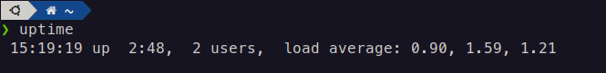

# Uptime in linux

## Introduction

`uptime` is a simple command in `linux`, which shows you
how long the system has been running.

In this article, we are going to explain all the
information that `uptime` provides.

`uptime` only has one line which can be divided to
3 parts that we explain all of them.

## Time

This part shows the current time, status of the system
(up), and how long the system has been running.

In this case, the current time was `15:19:19`, and
system has been running for 2 hours and 48 minutes.

## Users

This part shows how many users are connected to
the system.

In this case, there are two users connected to
the system, one `sudo` and the other one is a
normal user.

## Load average

