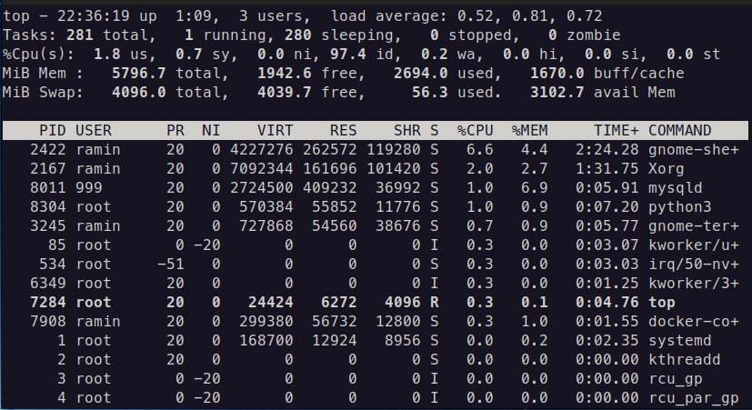

# Renice a process in top

Sometimes we want a process to have a
higher priority on a scheduler.
To achieve that goal we can change
the `nice` value of that process that
is known as `renicing` a process.
One of the ways that we can `renice` a
process is by using `top` command in
Linux.

In this article, we explain different
values that can be set as a `nice` value
of a process and how we `renice` a process
by using `top`.

## Nice value

Every process in Linux has a `nice` value.
This value is considered a number that tells
the scheduler how important that process is.
A `Nice` value is a number between -20 and 19
that **-20** means the highest priority
and **19** means the lowest priority.




As shown in the figure above, 
you can see the nice value of each process in
`top` by looking at the `NI` column.

## Renice in top

To `renice` a value in `top`, first, we need
to run it as a `superuser`, like this:

```shell
sudo top
```

Then we should press the `r` key.
After pressing the `r` key, `top` ask us
about the process that we want to be `renice`d by
a message like this:

```text
PID to renice
```

Then we should enter the `pid` of the
process. You can find the `pid` of each process
in `top` by looking at the `PID` column in `top`.

After entering the `pid`, `top` asks us about
the nice value that we want to set by a message
like this:

```text
Renice PID x to value
```

Then we should enter a value between -19 
(highest priority) and 20 (lowest priority).

After pressing enter, we can see that the `nice`
value of that process has changed.
