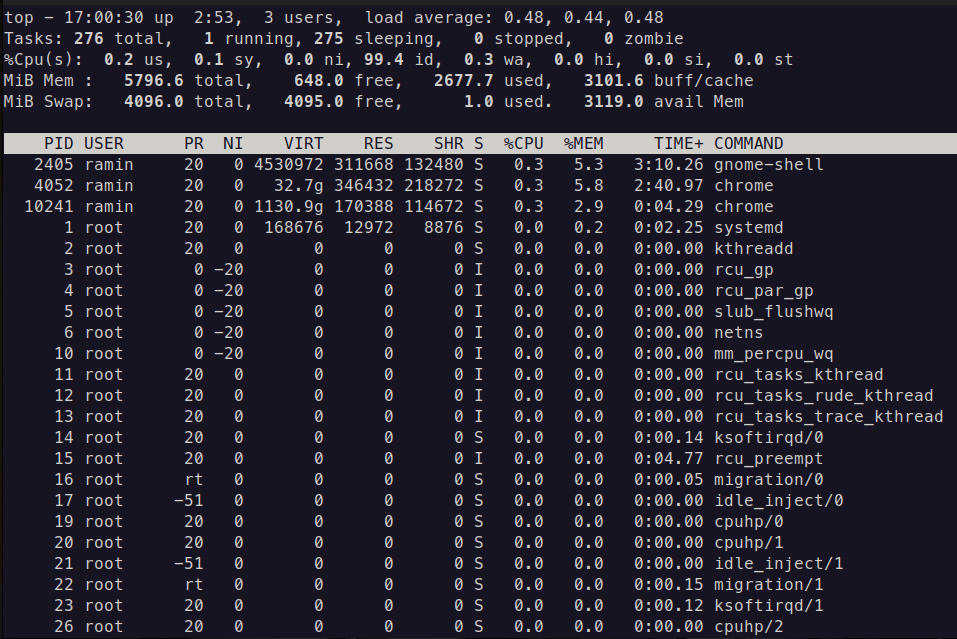

# Top in Linux

## Introduction

`Top` is a program in `Linux`, which shows us 
which processes are currently running in our system.

By default, `top` has 2 main parts:

1. Summary display 
2. Task infromations

## Summary display
